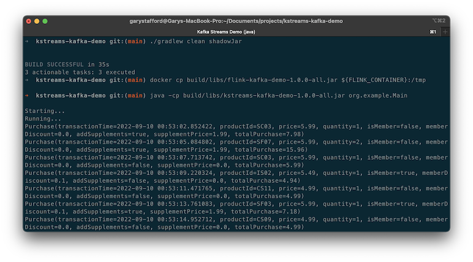

# Apache Kafka Streams Demo

[Apache Kafka Streams](https://kafka.apache.org/documentation/streams/) streaming data analytics demonstration, written in Java and
using the [Streaming Synthetic Sales Data Generator](https://github.com/garystafford/streaming-sales-generator). Consumes a stream of sales transaction messages and publishes a stream of running totals of product transactions, quantities, and sales to a Kafka topic.

* Demonstration uses
  Kafka/Flink [Docker Swarm Stack](https://github.com/garystafford/streaming-sales-generator/blob/main/docker-compose.yml)
  from 'Sales Data Generator' project

* Uber JAR built with Gradle using Amazon Corretto (OpenJDK) version 17 (openjdk version "17.0.3" 2022-04-19 LTS)



## Video Demonstration

Short [YouTube video](https://youtu.be/Hdo4giJePCk) demonstration of this project (video only - no audio).

## Input Message Stream

Sample sales purchase messages:

```txt
{"transaction_time": "2022-09-09 18:15:14.260159", "product_id": "SF06", "price": 5.99, "quantity": 1, "is_member": false, "member_discount": 0.0, "add_supplements": false, "supplement_price": 0.0, "total_purchase": 5.99}
{"transaction_time": "2022-09-09 18:15:17.484820", "product_id": "CS09", "price": 4.99, "quantity": 2, "is_member": true, "member_discount": 0.1, "add_supplements": false, "supplement_price": 0.0, "total_purchase": 8.98}
{"transaction_time": "2022-09-09 18:15:19.711103", "product_id": "CS02", "price": 4.99, "quantity": 1, "is_member": false, "member_discount": 0.0, "add_supplements": false, "supplement_price": 0.0, "total_purchase": 4.99}
{"transaction_time": "2022-09-09 18:15:22.942512", "product_id": "CS05", "price": 4.99, "quantity": 1, "is_member": false, "member_discount": 0.0, "add_supplements": false, "supplement_price": 0.0, "total_purchase": 4.99}
{"transaction_time": "2022-09-09 18:15:26.086557", "product_id": "IS01", "price": 5.49, "quantity": 1, "is_member": false, "member_discount": 0.0, "add_supplements": false, "supplement_price": 0.0, "total_purchase": 5.49}
{"transaction_time": "2022-09-09 18:15:29.220133", "product_id": "SF03", "price": 5.99, "quantity": 2, "is_member": false, "member_discount": 0.0, "add_supplements": false, "supplement_price": 0.0, "total_purchase": 11.98}
{"transaction_time": "2022-09-09 18:15:32.351425", "product_id": "CS08", "price": 4.99, "quantity": 1, "is_member": true, "member_discount": 0.1, "add_supplements": false, "supplement_price": 0.0, "total_purchase": 4.49}
{"transaction_time": "2022-09-09 18:15:34.473913", "product_id": "CS05", "price": 4.99, "quantity": 3, "is_member": false, "member_discount": 0.0, "add_supplements": false, "supplement_price": 0.0, "total_purchase": 14.97}
{"transaction_time": "2022-09-09 18:15:35.706493", "product_id": "SC03", "price": 5.99, "quantity": 2, "is_member": true, "member_discount": 0.1, "add_supplements": false, "supplement_price": 0.0, "total_purchase": 10.78}
{"transaction_time": "2022-09-09 18:15:36.938348", "product_id": "CS09", "price": 4.99, "quantity": 1, "is_member": false, "member_discount": 0.0, "add_supplements": false, "supplement_price": 0.0, "total_purchase": 4.99}
```

## Output Message Stream

Sample running product total messages:

```txt
{"event_time":"2022-09-10T02:30:04.606869Z","product_id":"IS02","transactions":17,"quantities":34,"sales":204.71}
{"event_time":"2022-09-10T02:30:05.836092Z","product_id":"SC03","transactions":14,"quantities":15,"sales":103.79}
{"event_time":"2022-09-10T02:30:09.066187Z","product_id":"CS09","transactions":22,"quantities":46,"sales":249.13}
{"event_time":"2022-09-10T02:30:12.295890Z","product_id":"SC01","transactions":11,"quantities":23,"sales":164.82}
{"event_time":"2022-09-10T02:30:13.520157Z","product_id":"SC04","transactions":22,"quantities":45,"sales":297.96}
{"event_time":"2022-09-10T02:30:15.747421Z","product_id":"SC05","transactions":14,"quantities":23,"sales":165.63}
{"event_time":"2022-09-10T02:30:16.999707Z","product_id":"CS10","transactions":12,"quantities":22,"sales":122.80}
{"event_time":"2022-09-10T02:30:18.235349Z","product_id":"CS08","transactions":29,"quantities":46,"sales":252.74}
{"event_time":"2022-09-10T02:30:19.360850Z","product_id":"CS03","transactions":7,"quantities":17,"sales":101.07}
{"event_time":"2022-09-10T02:30:21.601005Z","product_id":"CS03","transactions":8,"quantities":18,"sales":105.56}
{"event_time":"2022-09-10T02:30:22.834962Z","product_id":"IS04","transactions":12,"quantities":24,"sales":159.76}
```

## Compile and Run KStreams App

```shell
# optional - set java version (v17 is latest compatible)
JAVA_HOME=~/Library/Java/JavaVirtualMachines/corretto-17.0.3/Contents/Home/

# compile to uber jar
./gradlew clean shadowJar

# run the streaming application
java -jar build/libs/kstreams-kafka-demo-1.0.0-all.jar
```

## Docker Stack

Demonstration uses Kafka/Flink [Docker Swarm Stack](https://github.com/garystafford/streaming-sales-generator/blob/main/docker-compose.yml) from 'Sales Data Generator' project.
  
See [bitnami/kafka](https://hub.docker.com/r/bitnami/kafka) on Docker Hub for more information about running Kafka
locally using Docker.

```shell
# optional: delete previous stack
docker stack rm kafka-flink

# deploy kafka stack
docker swarm init
docker stack deploy kafka-flink --compose-file docker-compose.yml
```

## Kafka

Helpful Kafka commands.

```shell
docker exec -it $(docker container ls --filter  name=kafka-flink_kafka --format "{{.ID}}") bash

export BOOTSTRAP_SERVERS="localhost:9092"
export INPUT_TOPIC="demo.purchases"
export OUTPUT_TOPIC="demo.totals"

# list all topics
kafka-topics.sh --list \
    --bootstrap-server $BOOTSTRAP_SERVERS

# describe topic
kafka-topics.sh --describe \
    --topic $OUTPUT_TOPIC \
    --bootstrap-server $BOOTSTRAP_SERVERS

# delete topic
kafka-topics.sh --delete \
    --topic $INPUT_TOPIC \
    --bootstrap-server $BOOTSTRAP_SERVERS

kafka-topics.sh --delete \
    --topic $OUTPUT_TOPIC \
    --bootstrap-server $BOOTSTRAP_SERVERS

# optional: create new topic (or they will be automatically created
kafka-topics.sh --create \
    --topic $INPUT_TOPIC \
    --partitions 1 --replication-factor 1 \
    --config cleanup.policy=compact \
    --bootstrap-server $BOOTSTRAP_SERVERS

kafka-topics.sh --create \
    --topic $OUTPUT_TOPIC \
    --partitions 1 --replication-factor 1 \
    --config cleanup.policy=compact \
    --bootstrap-server $BOOTSTRAP_SERVERS

# view messages
kafka-console-consumer.sh \
    --topic $INPUT_TOPIC --from-beginning \
    --bootstrap-server $BOOTSTRAP_SERVERS

kafka-console-consumer.sh \
    --topic $OUTPUT_TOPIC --from-beginning \
    --bootstrap-server $BOOTSTRAP_SERVERS
```

## References

- <https://github.com/apache/kafka/blob/1.0/streams/examples/src/main/java/org/apache/kafka/streams/examples/pageview/PageViewTypedDemo.java>
- <https://github.com/simplesteph/kafka-streams-course>
- <https://medium.com/@agvillamizar/implementing-custom-serdes-for-java-objects-using-json-serializer-and-deserializer-in-kafka-streams-d794b66e7c03>

---

_The contents of this repository represent my viewpoints and not of my past or current employers, including Amazon Web Services (AWS). All third-party libraries, modules, plugins, and SDKs are the property of their respective owners. The author(s) assumes no responsibility or liability for any errors or omissions in the content of this site. The information contained in this site is provided on an "as is" basis with no guarantees of completeness, accuracy, usefulness or timeliness._
